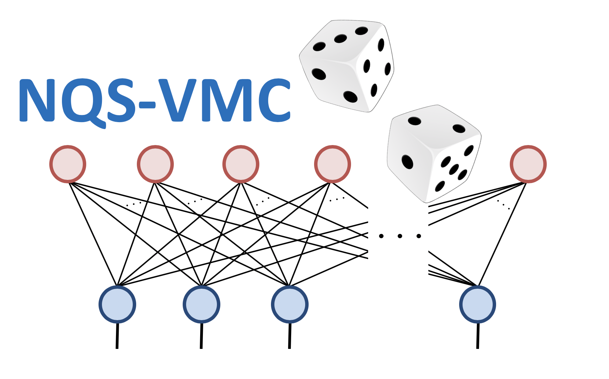

# NQS-VMC
Neural-network Quantum State - Variational Quantum Monte Carlo: a MATLAB implementation
===================================================================================================

Copyright (C) 2019 **Michael Pei** and **Stephen Clark**

Ansatz
--------------------

This page documents the details of the Ansatz class and related functions. 

N.B: This documentation is a work in progress.

[Back to index.](MATLAB/Documentation/index)

Classes
--------------------

* `Ansatz`
    * Constructed as `Ansatz(Reference,{Modifiers},Hilbert)`        
    * Class properties include:
        * `Reference`
        * `Modifier`
        * `Hilbert`
        * `Var`
        * `NpTotal`

Functions
--------------------

* `Ansatz.VarFlagRef`
* `Ansatz.VarFlagMod`
* `Ansatz.RefReplace`
* `Ansatz.ModReplace`
* `Ansatz.ModRemove`
* `Ansatz.HilbertReplace`
* `Ansatz.RndBatchSelect`
* `Ansatz.LogDeriv`
* `Ansatz.ParamList`
* `Ansatz.ParamLoad`
* `Ansatz.PrepPsi`
* `Ansatz.PsiCfgUpdate`
* `Ansatz.PsiRatio`
* `Ansatz.PsiUpdate`