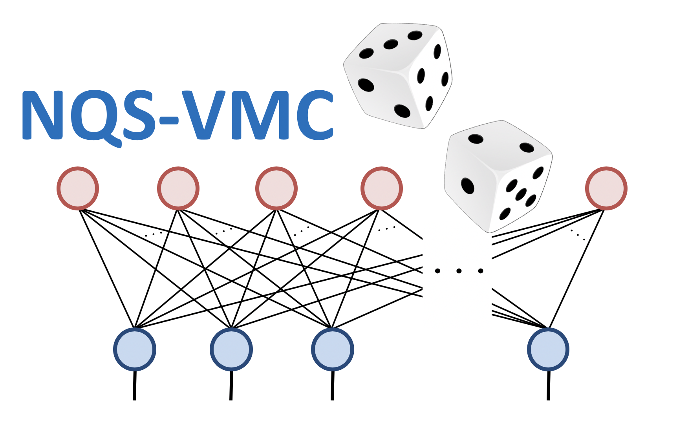

# NQS-VMC
Neural-network Quantum State - Variational Quantum Monte Carlo: a MATLAB implementation
===================================================================================================

Copyright (C) 2019 **Michael Pei** and **Stephen Clark**

Index
--------------------

This is the index of the NQS-VMC MATLAB documentation, which will introduce the classes and functions present in the MATLAB version of the code. Example use cases will be added over the course of development. The documentation is a work in progress and will be filled out as development continues.

## Contents

* [Graphs](graph)
* [Hilbert](hilbert)
* [Operators](operator)
* [Hamiltonian](hamiltonian)
* [Sampler](sampler)
* [Optimisers](optimiser)
* [References](reference)
* [Modifiers](modifier)
* [Ansatze](ansatz)

Quick reference
--------------------

